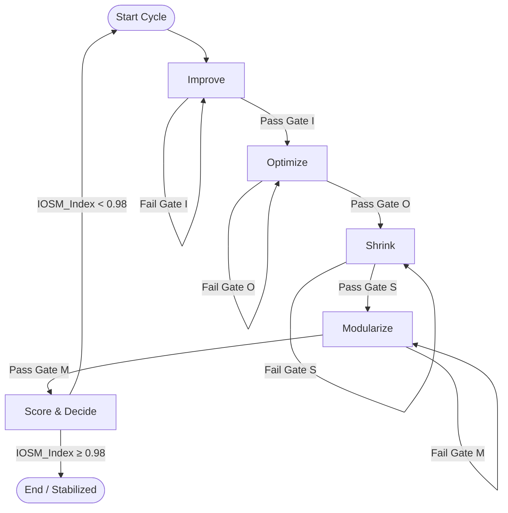

# IOSM v1.0: An Algorithmic Framework for Engineering Excellence

  

**IOSM (Improve → Optimize → Shrink → Modularize)** is a reproducible methodology for continuous system improvement, combining engineering rigor with business rationality. Unlike declarative approaches, IOSM turns concepts into an executable discipline, ready for CI/CD automation.

This repository contains the official technical specification, playbook, and examples for the IOSM methodology.

## Table of Contents

1. [What Problem Does IOSM Solve?](#what-problem-does-iosm-solve)
2. [The Four Pillars of IOSM](#the-four-pillars-of-iosm)
3. [The IOSM Cycle: A Visual Diagram](#the-iosm-cycle-a-visual-diagram)
4. [How It Works: The Algorithm](#how-it-works-the-algorithm)
5. [Configuration: Your `iosm.yaml`](#configuration-your-iosmyaml)
6. [Quick Start: Adopting IOSM in Your Team](#quick-start-adopting-iosm-in-your-team)
7. [Real-World Example: Building the AstroVisor API Platform](#real-world-example-building-the-astrovisor-api-platform)
8. [Core Values](#core-values)
9. [Contributing](#contributing)
10. [Author](#author)
11. [License](#license)

## What Problem Does IOSM Solve?

Modern systems suffer from chaotic improvements, rising technical debt, and a disconnect between engineering efforts and business value. IOSM addresses this by providing:

* **A predictable process** for refactoring and system evolution.
* **Automated quality control** through measurable Quality Gates.
* **Economic prioritization** to ensure engineering work delivers value.
* **A holistic framework** for creating systems that are **clear, fast, simple, and scalable**.

## The Four Pillars of IOSM

IOSM is a sequential, iterative process built on four foundational pillars:

* 🧠 **Improve**: Achieve structural clarity. Eliminate duplication, contradictions, and ambiguity. A system that isn't understood cannot be improved.
* ⚡️ **Optimize**: Maximize efficiency and resilience. Profile bottlenecks, apply performance patterns, and ensure the system is fault-tolerant.
* 🧹 **Shrink**: Minimize unnecessary complexity. Remove dead code, redundant abstractions, and simplify APIs to reduce cognitive load and improve Developer Experience (DX).
* 🧱 **Modularize**: Design for evolution. Decompose the system into independent, loosely coupled modules with clear contracts, enabling parallel work and safe, independent deployments.

## The IOSM Cycle: A Visual Diagram

The core of IOSM is a closed loop, where each step must pass a **Quality Gate** before moving forward. The cycle continues until the system’s health score (`IOSM-Index`) stabilizes at a high level.



This diagram is simplified:

* Each phase loops only to itself if a gate fails.
* Flow is always forward on success.
* Decision at the end is a single clean branch.

## How It Works: The Algorithm

IOSM is defined by an orchestration algorithm that can be automated in your CI/CD pipeline.

```pseudocode
ALGORITHM IOSM_ORCHESTRATOR(system, config):
    history ← []
    LOOP:
        backlog_items ← GET_BACKLOG_FOR(system)
        prioritized_goals ← ECONOMIC_DECISION(backlog_items)
        IF IS_EMPTY(prioritized_goals) THEN BREAK

        state ← IMPROVE
        WHILE state ≠ SCORE:
            IF state = IMPROVE:
                result_I ← RUN_IMPROVE(system, prioritized_goals)
                report_I ← EVALUATE_GATE_I(result_I, config.gate_I)
                state ← OPTIMIZE IF report_I.pass ELSE IMPROVE
            IF state = OPTIMIZE:
                result_O ← RUN_OPTIMIZE(system, prioritized_goals)
                report_O ← EVALUATE_GATE_O(result_O, config.gate_O)
                state ← SHRINK IF report_O.pass ELSE OPTIMIZE
            IF state = SHRINK:
                result_S ← RUN_SHRINK(system, prioritized_goals)
                report_S ← EVALUATE_GATE_S(result_S, config.gate_S)
                state ← MODULARIZE IF report_S.pass ELSE SHRINK
            IF state = MODULARIZE:
                result_M ← RUN_MODULARIZE(system, prioritized_goals)
                report_M ← EVALUATE_GATE_M(result_M, config.gate_M)
                state ← SCORE IF report_M.pass ELSE MODULARIZE

        metrics ← COLLECT_METRICS(system)
        index ← CALC_IOSM_INDEX(metrics, config.index_weights)
        decision ← DECIDE_NEXT_CYCLE(index, history)
        APPEND(history, {index, metrics})
        IF decision = STOP THEN RETURN {index, metrics, history}
```

## Configuration: Your `iosm.yaml`

Adapt IOSM to your project's needs with a simple configuration file.

```yaml
iosm:
  planning:
    use_economic_decision: true
  quality_gates:
    gate_I:
      semantic_coherence: 0.95
      duplication_max: 0.05
    gate_O:
      latency_ms: { p95: 150, p99: 250 }
      error_budget_respected: true
    gate_S:
      api_surface_reduction: 0.20
      onboarding_time_minutes: 15
    gate_M:
      change_surface_max: 3
      contracts_pass: true
  index_weights:
    semantic: 0.15
    logic: 0.20
    performance: 0.25
    simplicity: 0.15
    modularity: 0.15
    flow: 0.10
```

## Quick Start: Adopting IOSM in Your Team

**Weeks 1-2: Baseline and Foundation**

* Fork this repository.
* Define your initial `iosm.yaml` by setting realistic targets for your system.
* Implement basic checks for Gate-I (Improve) like linters and code duplication detectors (e.g., SonarQube).
* Implement basic checks for Gate-S (Shrink) like tracking unused dependencies.
* Establish your performance baseline.

**Months 1-2: Automate and Integrate**

* Automate your performance and load tests to enable Gate-O (Optimize).
* Integrate contract testing (e.g., Pact) or schema validation to enable Gate-M (Modularize).
* Set up a dashboard to track your IOSM-Index over time.

**Quarter 1: Stabilize and Scale**

* Run your first full IOSM cycles on a key component of your system.
* Aim to stabilize the IOSM-Index at ≥ 0.98 for that component.
* Share your results and scale the practice to other teams.

## Real-World Example: Building the AstroVisor API Platform

The architecture of the [AstroVisor.io](https://astrovisor.io/) professional astrology platform serves as a prime example of applying IOSM principles to manage extreme complexity and achieve high performance.

* 🧠 **Improve: Taming Astrological Complexity**

  * **Problem:** Early development faced chaos from overlapping logic for 14 different astrological systems.
  * **IOSM Application:** Before writing all 95 endpoints, the first step was to **Improve** the structure. A clear domain model was established with unified data structures for core concepts (`CelestialBody`, `Aspect`). A `Structure Map` grouped endpoints logically (Core, Predictive, Synastry), bringing semantic clarity and eliminating duplication.

* ⚡️ **Optimize: Achieving 40ms Average Response Time**

  * **Problem:** Complex calculations are computationally expensive. The 40ms performance target was impossible with a naive approach.
  * **IOSM Application:** The **Optimize** phase began with extensive profiling, which identified ephemeris lookups as bottlenecks. To meet the strict performance SLO, targeted optimizations were applied: a Redis caching layer, parallel processing for complex charts, and a global CDN.

* 🧹 **Shrink: Simplifying Access with an MCP Server**

  * **Problem:** Exposing 95+ complex endpoints could overwhelm developers and AI agents.
  * **IOSM Application:** The **Shrink** phase reduced cognitive load by introducing an **MCP server for Claude**, collapsing 95 REST calls into a natural-language interface for AI clients—dramatically shrinking the usable API surface.

* 🧱 **Modularize: Designing for Future Traditions**

  * **Problem:** The platform supports 14 astrological systems. How to add a 15th without rewriting the core?
  * **IOSM Application:** The calculation engine was built with **Modularize** in mind. Each tradition (e.g., `Western`, `Vedic`) is a self-contained module with a standardized contract. Adding a new tradition means implementing a new module that adheres to the contract without touching the existing 14.

## Core Values

* Clarity is a prerequisite for speed.
* Efficiency = performance × resilience.
* Simplicity reduces risks and costs.
* Modularity is the engine of evolution.
* Metrics over opinions.
* Economics of change drives prioritization.
* Feedback closure with business and users.

## Contributing

This is an open methodology, and contributions are welcome! Please feel free to open an issue to discuss improvements or submit a pull request to update the specification.

## Author

**Emil Rokossovsky**
GitHub: [@rokoss21](https://github.com/rokoss21)
Email: [ecsiar@gmail.com](mailto:ecsiar@gmail.com)

## License

This project is licensed under the MIT License. See the LICENSE file for details.
